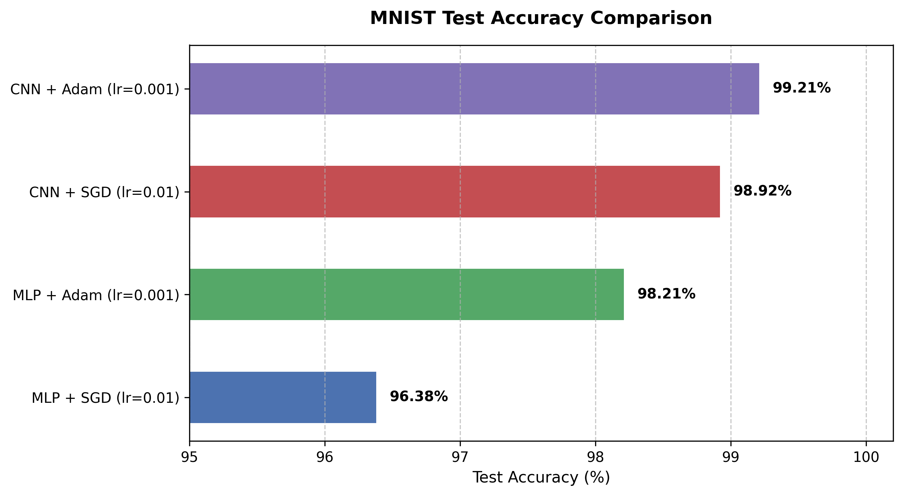
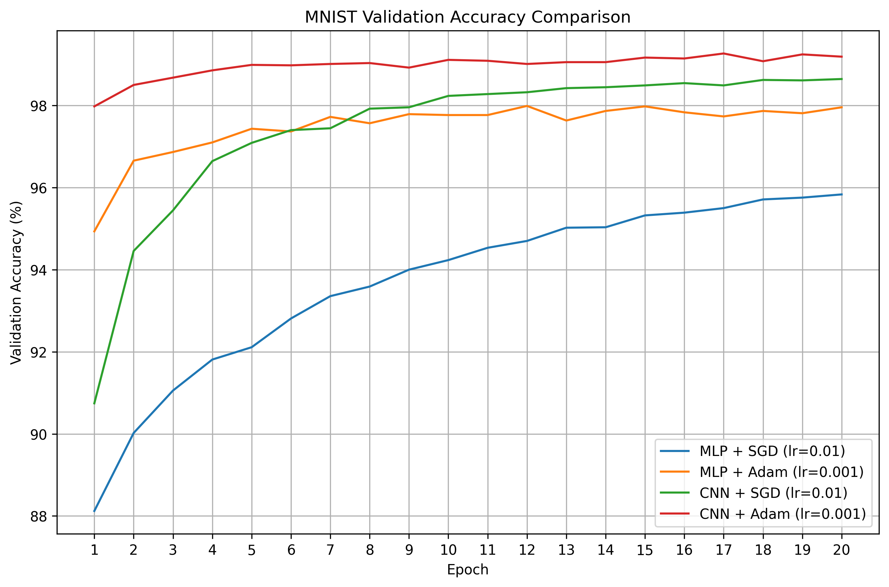
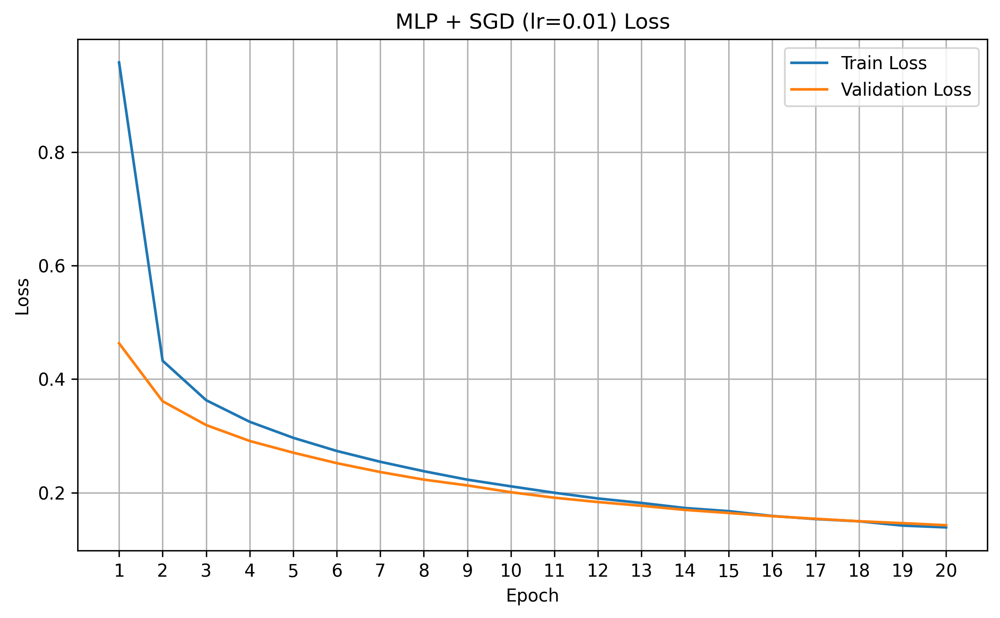
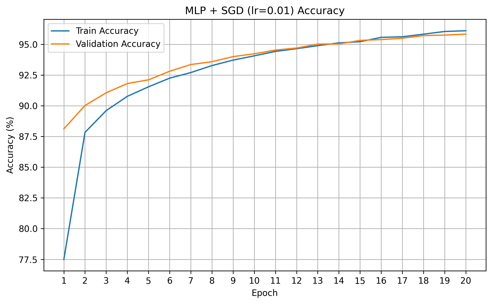
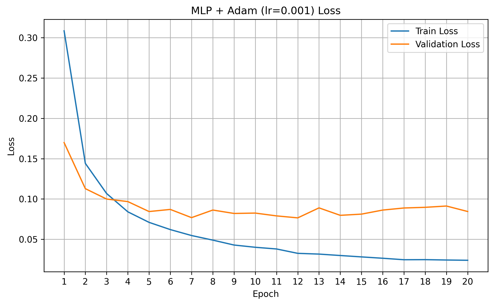
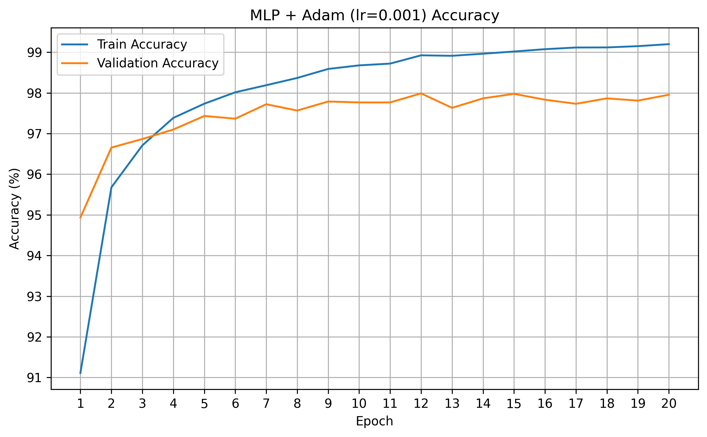
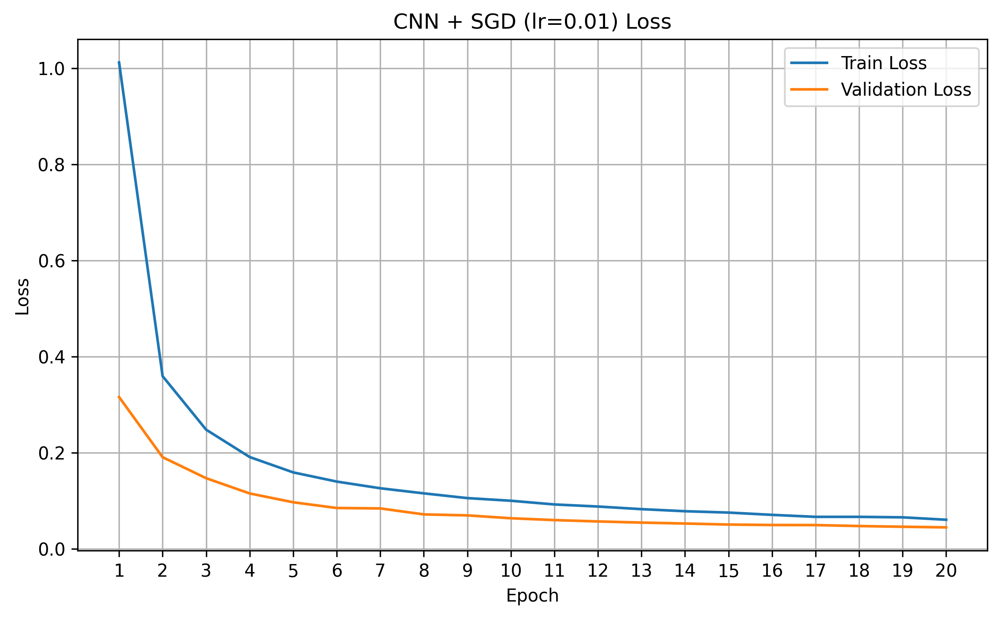
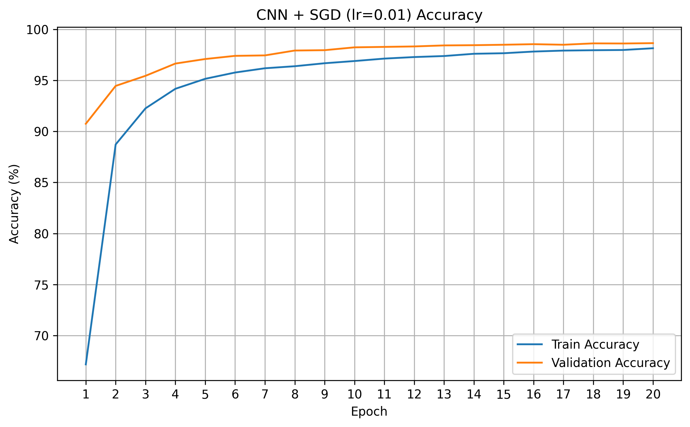
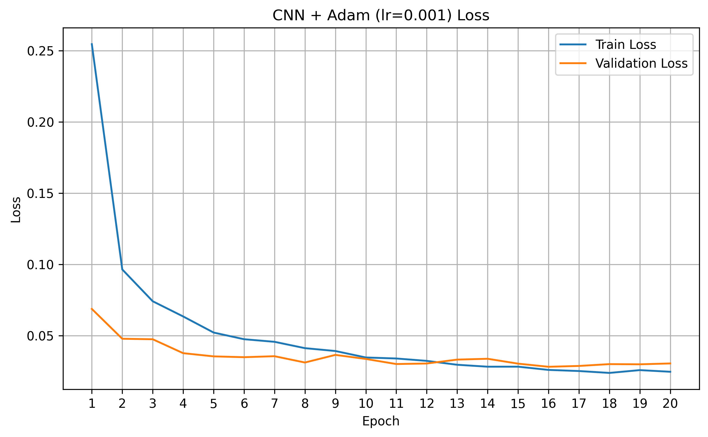
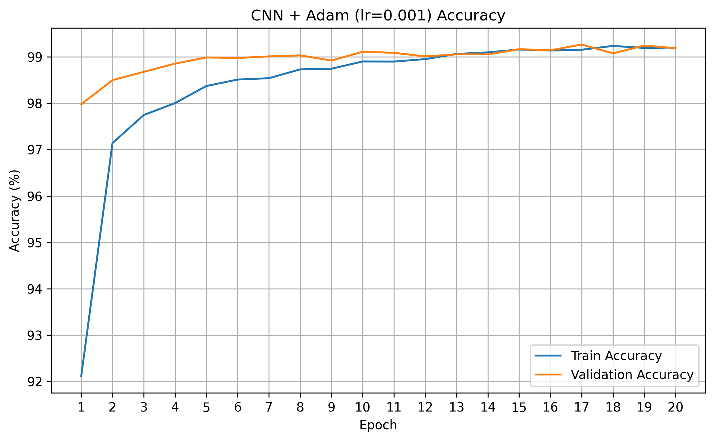

## Experiment Question

이 실험의 목적은 MNIST 이미지 분류에서 **모델 구조와 학습 설정이 성능에 미치는 영향**을 비교하는 것이다.

구체적으로 다음 질문에 답하고자 한다.

1. 동일한 optimizer와 learning rate를 사용했을 때 CNN이 MLP보다 높은 분류 성능을 보이는가?
2. 동일한 모델에서 `SGD, lr=0.01`과 `Adam, lr=0.001`을 사용할 때 학습 과정과 최종 성능이 어떻게 달라지는가?
3. MLP와 CNN의 성능 차이가 모델 구조에서 주로 발생하는지, 아니면 optimizer와 learning rate를 포함한 학습 설정에서도 크게 영향을 받는지 확인한다.
4. 각 실험의 validation loss와 validation accuracy 변화를 비교하여 수렴 속도와 학습 안정성의 차이를 확인한다.

이번 실험에서는 optimizer와 learning rate가 함께 변경되므로, 두 설정의 차이를 단순히 optimizer만의 효과라고 해석하지 않고 **학습 설정 전체의 효과**로 해석한다.  

## Controlled Variables

네 가지 실험에서 다음 조건은 동일하게 유지한다.

- Dataset: MNIST
- 입력 전처리: `transforms.ToTensor()`
- 학습·검증 데이터 분할 비율: 85% / 15%
- Test dataset: MNIST 공식 test dataset
- Random seed: 42
- Batch size: 32
- Epochs: 20
- Loss function: `nn.CrossEntropyLoss()`
- Train/validation/test loss 계산 방식
- Train/validation/test accuracy 계산 방식
- 동일한 train/validation 데이터 분할
- 동일한 학습 데이터 shuffle 순서
- 동일한 실행 장치
- 동일한 성능 기록 및 그래프 저장 방식

동일한 seed와 generator를 사용하여 코드를 다시 실행해도 같은 MNIST 이미지가 train set과 validation set에 포함되고, 같은 순서로 학습 데이터가 제공되도록 한다.

모든 실험에서 epoch별 train loss, validation loss, train accuracy, validation accuracy를 동일한 방식으로 계산하고 기록한다. 최종 평가는 동일한 test dataset을 사용하여 수행한다. 

단, 다음 요소는 실험에서 비교하기 위해 변경한다.

- Model architecture: MLP 또는 CNN
- Optimizer: SGD 또는 Adam
- Learning rate: 0.01 또는 0.001

## Experiment Settings

### Model Architecture

#### MLP

MLP는 MNIST 이미지의 `[1, 28, 28]` 형태를 784개의 값으로 펼친 뒤 fully connected layer를 통과하도록 구성한다.

- Flatten
- Linear: 784 → 256
- ReLU
- Dropout: 0.3
- Linear: 256 → 10

#### CNN

CNN은 두 개의 convolution layer를 사용하여 이미지의 공간적 특징을 추출한 뒤 fully connected layer를 통해 10개 클래스를 분류한다.

- Conv2d: 1 → 32, kernel size 3, padding 1
- ReLU
- MaxPool2d: kernel size 2, stride 2
- Dropout: 0.25
- Conv2d: 32 → 64, kernel size 3, padding 1
- ReLU
- MaxPool2d: kernel size 2, stride 2
- Dropout: 0.25
- Flatten: `64 × 7 × 7`
- Linear: 3136 → 256
- ReLU
- Dropout: 0.5
- Linear: 256 → 10

### Training Combinations

| Experiment ID | Model | Optimizer | Learning Rate | Purpose |
|---|---|---|---:|---|
| `MLP_SGD_lr0.01` | MLP | SGD | 0.01 | 기존 MLP 학습 설정 |
| `MLP_Adam_lr0.001` | MLP | Adam | 0.001 | MLP에서 학습 설정 변경 효과 확인 |
| `CNN_SGD_lr0.01` | CNN | SGD | 0.01 | CNN에서 학습 설정 변경 효과 확인 |
| `CNN_Adam_lr0.001` | CNN | Adam | 0.001 | 기존 CNN 학습 설정 |

### Main Comparisons

#### 동일한 모델에서 학습 설정 비교

- `MLP_SGD_lr0.01` vs. `MLP_Adam_lr0.001`
- `CNN_SGD_lr0.01` vs. `CNN_Adam_lr0.001`

이를 통해 동일한 모델에서 학습 설정이 수렴 속도와 최종 성능에 미치는 영향을 확인한다.

#### 동일한 학습 설정에서 모델 구조 비교

- `MLP_SGD_lr0.01` vs. `CNN_SGD_lr0.01`
- `MLP_Adam_lr0.001` vs. `CNN_Adam_lr0.001`

이를 통해 optimizer와 learning rate를 동일하게 유지했을 때 MLP와 CNN의 구조적 차이가 성능에 미치는 영향을 확인한다.
## Final Results

네 가지 실험의 최종 결과는 다음과 같다.

`Best Epoch`는 validation accuracy가 가장 높았던 epoch를 의미한다.

| Experiment | Parameters | Best Epoch | Best Validation Accuracy | Final Validation Accuracy | Test Accuracy | Training Time |
|---|---:|---:|---:|---:|---:|---:|
| `MLP_SGD_lr0.01` | 203,530 | 20 | 95.83% | 95.83% | 96.38% | 179.44초 |
| `MLP_Adam_lr0.001` | 203,530 | 12 | 97.99% | 97.96% | 98.21% | 186.97초 |
| `CNN_SGD_lr0.01` | 824,458 | 20 | 98.64% | 98.64% | 98.92% | 214.34초 |
| `CNN_Adam_lr0.001` | 824,458 | 17 | **99.27%** | 99.19% | **99.21%** | 223.50초 |

가장 높은 test accuracy는 **CNN + Adam, lr=0.001** 설정의 **99.21%**였다.

Test accuracy 순위는 다음과 같다.

1. `CNN_Adam_lr0.001`: 99.21%
2. `CNN_SGD_lr0.01`: 98.92%
3. `MLP_Adam_lr0.001`: 98.21%
4. `MLP_SGD_lr0.01`: 96.38%

동일한 학습 설정에서 CNN은 MLP보다 높은 test accuracy를 기록했다.

- SGD 설정: CNN이 MLP보다 **2.54%p** 높음
- Adam 설정: CNN이 MLP보다 **1.00%p** 높음

다만 CNN은 MLP보다 약 **4.05배 많은 parameter**를 사용했으며, 학습 시간도 약 19% 더 길었다.

---

## Learning Curve Comparison

### Validation Accuracy 비교

Validation accuracy 곡선을 비교하면 모델 구조와 학습 설정에 따라 수렴 속도가 뚜렷하게 달랐다.

- `MLP_SGD_lr0.01`은 네 실험 중 가장 천천히 학습했으며, epoch 20까지 validation accuracy가 계속 증가했다.
- `MLP_Adam_lr0.001`은 초반에 빠르게 학습했지만, 이후 validation accuracy가 약 98% 부근에서 정체되었다.
- `CNN_SGD_lr0.01`은 MLP + SGD보다 빠르게 성능이 증가했으며, epoch 20까지 꾸준히 개선되었다.
- `CNN_Adam_lr0.001`은 첫 epoch부터 약 98%의 validation accuracy를 기록했고, 이후 약 99% 수준을 안정적으로 유지했다.

이번 실험에서 Adam을 사용한 두 설정은 SGD를 사용한 설정보다 빠르게 수렴했다.

다만 Adam과 SGD에 서로 다른 learning rate를 사용했기 때문에, 이를 optimizer만의 차이라고 해석할 수는 없다. 이번 결과는 `SGD, lr=0.01`과 `Adam, lr=0.001`이라는 두 학습 설정의 차이로 해석해야 한다.

또한 두 SGD 실험은 epoch 20에서도 validation 성능이 계속 증가했다. 따라서 SGD 설정은 더 많은 epoch를 학습했을 때 추가적인 성능 향상이 나타날 가능성이 있다.

> 일부 epoch에서 validation accuracy가 train accuracy보다 높게 나타났다.  
> 두 모델 모두 Dropout을 사용하기 때문에 training 과정에서는 일부 neuron이 비활성화되지만, validation 과정에서는 Dropout이 비활성화된다. 또한 train metric은 한 epoch 동안 계속 갱신되는 모델의 결과를 누적하고, validation metric은 epoch 학습이 끝난 모델로 계산한다. 이러한 이유로 validation 성능이 train 성능보다 일시적으로 높게 나타날 수 있다.

### 개별 Learning Curve

<strong>MLP + SGD, lr=0.01</strong>

Train loss와 validation loss가 모두 꾸준히 감소했고, 두 곡선의 차이도 크지 않았다.

Train accuracy와 validation accuracy 역시 epoch 20까지 계속 증가했다. 뚜렷한 과적합은 나타나지 않았지만, 다른 실험보다 수렴 속도가 느렸다.

<strong>MLP + Adam, lr=0.001</strong>

Train loss는 epoch 20까지 계속 감소했지만, validation loss는 초반 감소한 뒤 약 0.08 부근에서 정체되거나 변동했다.

Train accuracy는 99.20%까지 증가했지만, validation accuracy는 약 98% 부근에서 정체되었다. 특히 best validation accuracy를 기록한 epoch 12 이후에는 train 성능만 계속 개선되는 경향이 나타났다.

이는 MLP + Adam 설정에서 약한 과적합이 시작되었을 가능성을 보여준다.

<strong>CNN + SGD, lr=0.01</strong>

Train loss와 validation loss가 모두 안정적으로 감소했다.

Validation accuracy는 epoch 1의 90.74%에서 epoch 20의 98.64%까지 꾸준히 증가했다. 마지막 epoch에서도 최고 validation accuracy를 기록했기 때문에 아직 완전히 수렴했다고 보기는 어렵다.

<strong>CNN + Adam, lr=0.001</strong>

CNN + Adam은 네 실험 중 가장 빠르게 높은 성능에 도달했다.

Validation accuracy는 epoch 1부터 97.98%였으며, epoch 2에는 98.50%에 도달했다. 이후 약 99% 수준에서 작은 범위로 변동했다.

Validation loss는 전반적으로 감소했지만 후반부에는 약간의 변동이 나타났다. 그러나 최종 train accuracy와 validation accuracy가 각각 99.20%, 99.19%로 거의 같아 일반화 성능은 안정적으로 유지되었다.

---

## Findings

### 1. MLP에서 학습 설정의 영향

MLP에서 `Adam, lr=0.001` 설정은 `SGD, lr=0.01` 설정보다 빠르게 수렴하고 더 높은 최종 성능을 기록했다.

- MLP + SGD test accuracy: 96.38%
- MLP + Adam test accuracy: 98.21%
- 차이: **1.83%p**

MLP + Adam은 epoch 4에서 이미 97.10%의 validation accuracy를 기록했다. 반면 MLP + SGD의 epoch 4 validation accuracy는 91.81%였다.

따라서 이번 실험에서 Adam 설정은 MLP의 초기 수렴 속도를 크게 향상시켰다.

다만 MLP + Adam은 epoch 12에서 최고 validation accuracy인 97.99%를 기록한 이후, train loss와 train accuracy는 계속 개선되었지만 validation 성능은 더 이상 뚜렷하게 개선되지 않았다.

따라서 MLP에서는 Adam 설정이 빠른 수렴과 높은 최종 성능을 제공했지만, 후반부에는 과적합 조짐도 나타났다.

### 2. CNN에서 학습 설정의 영향

CNN에서도 `Adam, lr=0.001` 설정이 `SGD, lr=0.01`보다 빠르게 수렴했다.

- CNN + SGD test accuracy: 98.92%
- CNN + Adam test accuracy: 99.21%
- 차이: **0.29%p**

CNN + Adam은 epoch 2에서 validation accuracy 98.50%를 기록했다. CNN + SGD가 98%를 넘은 것은 epoch 10이었다.

따라서 수렴 속도에서는 Adam 설정의 장점이 명확하게 나타났다.

그러나 최종 test accuracy 차이는 0.29%p로 작았다. CNN + SGD도 epoch가 증가함에 따라 꾸준히 성능이 향상되어 CNN + Adam과 가까운 최종 성능에 도달했다.

즉, CNN에서는 Adam 설정이 최종 정확도를 크게 높였다기보다는 높은 정확도에 더 빠르게 도달하도록 만든 효과가 더 크게 나타났다.

### 3. SGD 설정에서 MLP와 CNN 비교

동일하게 `SGD, lr=0.01`을 사용했을 때 CNN이 MLP보다 높은 성능을 기록했다.

- MLP + SGD test accuracy: 96.38%
- CNN + SGD test accuracy: 98.92%
- 차이: **2.54%p**

CNN은 이미지의 공간적 구조를 유지한 상태에서 convolution filter를 통해 지역적인 특징을 학습한다.

반면 MLP는 `[1, 28, 28]` 이미지를 784개의 값으로 펼치기 때문에 pixel 사이의 공간적 관계를 모델 구조에서 직접 활용하지 못한다.

동일한 optimizer와 learning rate를 사용했음에도 CNN이 더 높은 성능을 기록한 것은 이미지 데이터에 적합한 CNN의 구조적 장점이 성능에 영향을 주었다는 것을 보여준다.

### 4. Adam 설정에서 MLP와 CNN 비교

동일하게 `Adam, lr=0.001`을 사용했을 때도 CNN이 MLP보다 높은 성능을 기록했다.

- MLP + Adam test accuracy: 98.21%
- CNN + Adam test accuracy: 99.21%
- 차이: **1.00%p**

SGD 설정에서의 차이인 2.54%p보다는 작았지만, Adam 설정에서도 CNN의 성능이 더 높았다.

MLP도 Adam 설정의 도움을 받아 높은 성능을 기록했지만, 후반부에는 train 성능과 validation 성능 사이의 차이가 커지는 경향이 나타났다.

반면 CNN + Adam은 최종 train accuracy와 validation accuracy가 거의 같았으며, test accuracy에서도 가장 높은 결과를 기록했다.

### 종합 해석

이번 실험에서는 모델 구조와 학습 설정이 모두 성능에 영향을 주었다.

첫째, 동일한 학습 설정에서 CNN은 항상 MLP보다 높은 test accuracy를 기록했다. 따라서 이미지의 공간적 특징을 활용하는 CNN의 구조가 MNIST 분류에 유리하게 작용했다고 볼 수 있다.

둘째, 동일한 모델에서는 `Adam, lr=0.001` 설정이 `SGD, lr=0.01`보다 빠르게 수렴했다.

셋째, 학습 설정 변경에 따른 성능 향상은 CNN보다 MLP에서 더 크게 나타났다.

- MLP: Adam 설정에서 1.83%p 향상
- CNN: Adam 설정에서 0.29%p 향상

따라서 이번 실험 범위에서는 CNN이 학습 설정과 관계없이 안정적으로 높은 성능을 보인 반면, MLP는 학습 설정의 영향을 상대적으로 더 크게 받았다.

다만 optimizer와 learning rate가 동시에 변경되었으므로, 이러한 차이를 Adam 또는 SGD 하나의 효과로 일반화해서는 안 된다.

---

## Limitations

### 1. 하나의 random seed만 사용했다

모든 실험에서 `seed=42`만 사용했다.

동일한 seed를 사용하여 네 실험의 조건을 통제했지만, 하나의 실행 결과만으로는 초기 weight, mini-batch 순서, train/validation 분할에 따른 변동성을 확인할 수 없다.

보다 신뢰할 수 있는 결과를 얻으려면 여러 seed로 실험을 반복하고 평균과 표준편차를 함께 보고해야 한다.

### 2. Optimizer와 learning rate가 동시에 변경되었다

SGD 실험에서는 `lr=0.01`, Adam 실험에서는 `lr=0.001`을 사용했다.

따라서 두 실험의 차이가 optimizer 때문인지 learning rate 때문인지 분리하여 확인할 수 없다.

이번 결과는 optimizer 단독 비교가 아니라 두 학습 설정 전체의 비교로 제한하여 해석해야 한다.

### 3. MLP와 CNN의 parameter 수가 다르다

MLP는 203,530개, CNN은 824,458개의 parameter를 사용했다.

CNN은 MLP보다 약 4.05배 많은 parameter를 가지므로, CNN의 성능 향상이 convolution 구조뿐만 아니라 더 큰 모델 크기의 영향도 받았을 수 있다.

모델 구조의 효과를 더 엄밀하게 비교하려면 두 모델의 parameter 수를 비슷하게 조정한 추가 실험이 필요하다.

### 4. 모든 실험에서 동일하게 20 epoch를 사용했다

Adam 설정은 비교적 이른 epoch에 수렴했지만, 두 SGD 설정은 epoch 20까지 validation 성능이 계속 증가했다.

동일한 epoch 수를 사용하는 것은 조건을 단순하게 통제할 수 있다는 장점이 있지만, 수렴 속도가 느린 SGD 설정에는 충분한 학습 시간이 아니었을 가능성이 있다.

추후에는 early stopping이나 learning rate scheduler를 사용하거나, validation 성능이 더 이상 개선되지 않을 때까지 학습하는 방법을 사용할 수 있다.

### 5. MNIST 데이터셋만 사용했다

MNIST는 크기가 작고 배경이 단순한 흑백 숫자 이미지로 구성되어 있다.

따라서 이번 결과가 복잡한 색상, 배경, 물체 형태를 포함한 실제 이미지 분류 문제에서도 동일하게 나타난다고 일반화할 수 없다.

다음 단계에서는 CIFAR-10을 사용하여 CNN을 더 복잡한 컬러 이미지 분류 문제에 적용할 수 있다.

### 6. 학습 시간은 Colab의 단일 실행 결과이다

Colab의 실행 속도는 할당된 CPU 또는 GPU, 런타임 상태, 데이터 로딩 속도 등에 따라 달라질 수 있다.

따라서 현재 기록된 학습 시간은 절대적인 benchmark가 아니라, 같은 실행 환경에서 네 실험의 상대적인 계산 비용을 비교하는 값으로 해석해야 한다.
