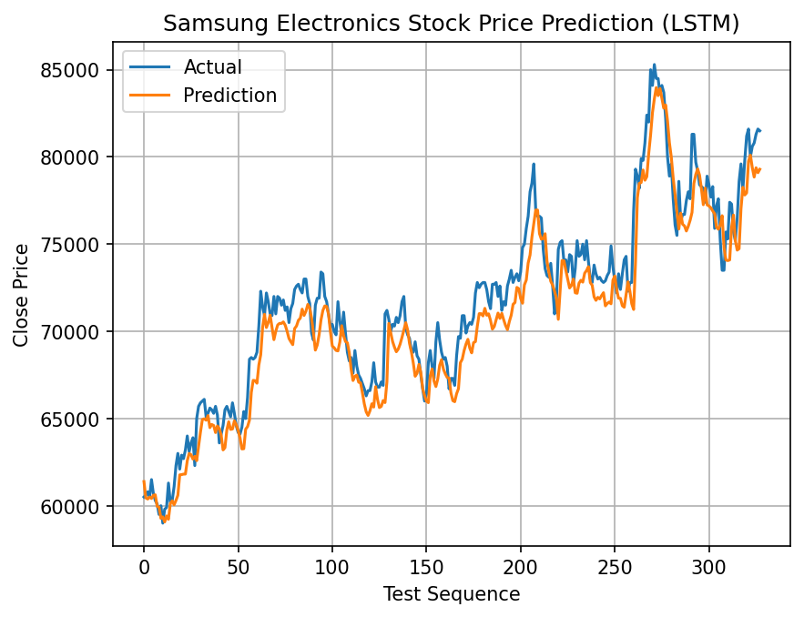

# LSTM vs GRU Stock Price Prediction

## 1. Experiment Purpose

동일한 삼성전자 주가 예측 task에서 LSTM과 GRU를 사용하여,
두 recurrent architecture의 구조적 차이가 parameter 수, 학습 시간, 예측 결과에 어떤 차이를 만드는지 확인한다.

두 모델에서 데이터와 학습 조건은 동일하게 유지하고, recurrent layer만 LSTM과 GRU로 변경하여 비교한다.

이번 실험의 목적은 어느 모델이 항상 더 우수한지를 판단하는 것이 아니라,
LSTM보다 단순화된 구조를 사용하는 GRU가 실제 학습에서 parameter 수와 예측 결과에 어떤 차이를 보이는지 직접 확인하는 것이다.

---

## 2. Common Settings

- Data: Samsung Electronics (`005930`)
- Data period: 2020-01-01 ~ 2024-06-30
- Train / Test split: 70% / 30%
- Input features: Open, High, Low, Volume
- Target: next-day Close
- Sequence length: 5
- Hidden size: 4
- Number of recurrent layers: 1
- Batch size: 20
- Epochs: 200
- Optimizer: Adam
- Learning rate: 0.001
- Loss function: `nn.MSELoss()`
- Feature / target scaling: `MinMaxScaler`

입력 sequence는 연속된 5일의 `Open`, `High`, `Low`, `Volume`으로 구성되며,
해당 sequence 다음 날의 `Close`를 하나 예측한다.

따라서 입력 shape은 `[B, 5, 4]`이고,
모델의 최종 prediction shape은 `[B, 1]`이다.

---

## 3. Model Difference

### LSTM

LSTM은 hidden state와 별도로 cell state를 유지한다.

- Hidden state: `h_t`
- Cell state: `c_t`
- Forget gate
- Input gate
- Output gate
- Candidate cell state

Cell state를 별도로 두고 여러 gate를 사용하여 과거 정보를 얼마나 유지하고,
새로운 정보를 얼마나 반영할지 조절한다.

### GRU

GRU는 LSTM보다 구조를 단순화하여 별도의 cell state 없이 hidden state 하나만 사용한다.

- Hidden state: `h_t`
- Reset gate
- Update gate
- Candidate hidden state

따라서 LSTM보다 recurrent 내부 계산과 parameter 수가 적다.

두 모델 모두 마지막 timestep의 hidden state를 가져온 뒤
`Linear(hidden_size, 1)` layer를 통해 다음 날 Close 하나를 예측한다.

---

## 4. Results

| Model | Parameters | Training Time | Final Train Loss | Test Loss |
|---|---:|---:|---:|---:|
| LSTM | 165 | 18.558 sec | 0.000826 | 0.001176 |
| GRU | 125 | 17.403 sec | 0.000819 | 0.001171 |

GRU의 trainable parameter 수는 **125개**로,
LSTM의 **165개**보다 40개 적었다.

즉, 현재 설정에서는 GRU가 LSTM보다 약 **24% 적은 parameter**를 사용했다.

이번 실행에서 학습 시간도 GRU가 `17.403 sec`, LSTM이 `18.558 sec`로
GRU가 약간 짧았다.

하지만 학습 시간은 GPU 및 실행 환경의 영향을 받을 수 있고,
이번 결과는 각 모델을 한 번 실행하여 측정한 값이므로
이 차이를 일반적인 GRU의 속도 우위로 해석하지는 않는다.

두 모델의 최종 train loss와 test loss는 매우 비슷했다.

- LSTM test loss: `0.001176`
- GRU test loss: `0.001171`

GRU의 test loss가 수치상 조금 더 낮지만 차이는 매우 작기 때문에,
이번 실험에서는 두 모델의 최종 예측 성능이 거의 유사했다고 보는 것이 적절하다.

> 여기서 Train Loss와 Test Loss는 MinMax scaling된 Close 값을 기준으로 계산한 MSE이다.
> 그래프에서는 prediction을 `inverse_transform`하여 실제 주가 단위로 복원하였다.

---

## 5. Prediction Comparison

### LSTM



LSTM의 prediction은 실제 Close의 전체적인 상승과 하락 추세를 비교적 잘 따라갔다.

다만 실제 주가의 단기적인 움직임보다 prediction curve가 조금 더 부드러운 형태를 보였으며,
급격한 상승이나 하락이 나타나는 구간에서는 실제 peak 또는 변동 폭을 완전히 따라가지 못하는 모습이 나타났다.

특히 실제 가격이 빠르게 상승하는 일부 구간에서는 prediction이 실제 값보다 낮게 나타나는 경향이 보였다.

### GRU


GRU 역시 실제 Close의 전체적인 추세를 잘 따라갔으며,
LSTM과 매우 유사한 prediction pattern을 보였다.

GRU에서도 prediction curve가 실제값보다 상대적으로 부드러웠으며,
급격한 가격 변화가 발생하는 구간에서는 실제 변동 폭을 다소 작게 예측하는 모습이 나타났다.

두 그래프를 비교했을 때 LSTM과 GRU 사이에 눈에 띄게 큰 예측 차이는 나타나지 않았고,
test loss가 거의 동일했던 결과와도 일치한다.

---

## 6. Observation

LSTM과 GRU는 동일한 데이터와 학습 설정을 사용했을 때
최종적으로 매우 유사한 train loss와 test loss를 기록했다.

가장 명확하게 나타난 차이는 **model complexity**였다.

GRU의 trainable parameter 수는 125개로 LSTM의 165개보다 적었다.
이는 GRU가 별도의 cell state를 사용하지 않고,
LSTM보다 단순한 gate 구조를 사용하기 때문이다.

그럼에도 불구하고 최종 test loss는:

```text
LSTM: 0.001176
GRU : 0.001171
```

로 거의 동일했다.

따라서 이번 삼성전자 next-day Close prediction task에서는
**GRU가 LSTM보다 적은 parameter를 사용하면서도 거의 동일한 예측 성능을 얻었다.**

학습 과정에서는 약간 다른 모습이 나타났다.

LSTM은 초반부터 loss가 비교적 빠르고 안정적으로 감소했다.

```text
Epoch 10 : 0.003149
Epoch 20 : 0.001781
Epoch 40 : 0.001419
```

반면 GRU는 초반 loss가 상대적으로 높았다.

```text
Epoch 10 : 0.048121
Epoch 20 : 0.029276
Epoch 30 : 0.003544
Epoch 40 : 0.001164
```

그러나 GRU의 loss는 약 30~40 epoch 사이에서 크게 감소했고,
이후에는 LSTM과 비슷한 수준으로 수렴했다.

따라서 이번 한 번의 실행에서는 LSTM이 초반에 더 빠르게 안정적인 loss에 도달했지만,
최종적으로는 두 모델이 거의 동일한 수준에 도달했다.

Prediction graph에서도 두 모델 모두 실제 주가의 큰 흐름은 잘 따라갔지만,
실제값보다 prediction이 조금 더 smooth하게 나타났다.

특히 급격한 상승이나 하락 구간에서는 실제 변동 폭을 완전히 따라가지 못했고,
일부 peak에서는 실제 Close보다 낮게 예측하는 모습이 공통적으로 나타났다.

결과적으로 이번 실험에서는 LSTM과 GRU 사이의 예측 성능 차이보다는,
**GRU가 더 단순하고 적은 parameter를 사용하면서도 LSTM과 비슷한 결과를 낼 수 있다는 점**이 더 의미 있는 관찰이었다.

---

## 7. Limitations

이번 실험에는 다음과 같은 한계가 있다.

- LSTM과 GRU를 각각 한 번만 실행한 결과이므로 random initialization에 따른 변동을 충분히 확인하지 않았다.
- Hidden size가 4로 매우 작은 모델이므로 더 큰 recurrent model에서도 동일한 결과가 나타난다고 일반화할 수 없다.
- 삼성전자 한 종목과 특정 기간의 데이터만 사용하였다.
- Sequence length를 5로 고정했기 때문에 더 긴 기간의 temporal dependency를 학습했을 때의 차이는 확인하지 않았다.
- 입력 feature는 `Open`, `High`, `Low`, `Volume`만 사용했으며, 다른 시장 정보나 외부 변수는 포함하지 않았다.
- 학습 시간은 단일 Colab GPU 실행 결과이므로 시스템 상태에 따라 달라질 수 있다.
- Test loss 차이가 매우 작고 여러 seed에서 반복 실험하지 않았기 때문에 GRU가 LSTM보다 더 높은 예측 성능을 가진다고 결론내릴 수 없다.

따라서 이번 실험의 결과는 두 architecture의 일반적인 우열을 판단하기보다는,
동일한 간단한 시계열 예측 task에서 LSTM과 GRU의 구조적 차이와 실제 동작을 비교한 학습 실험으로 해석한다.

---

## 8. Conclusion

동일한 삼성전자 주가 예측 task에서 LSTM과 GRU를 비교한 결과,
두 모델은 거의 동일한 수준의 train loss와 test loss를 기록했다.

LSTM은 165개의 trainable parameter를 사용한 반면,
GRU는 125개의 parameter만을 사용하여 더 작은 모델을 구성했다.

Prediction graph에서도 두 모델은 실제 Close의 전체적인 추세를 유사하게 따라갔으며,
급격한 가격 변동에서는 prediction이 상대적으로 부드럽게 나타나는 공통적인 특징을 보였다.

이번 실험을 통해 GRU가 LSTM의 구조를 단순화하여 parameter 수를 줄이면서도,
간단한 시계열 예측 문제에서는 LSTM과 유사한 성능을 얻을 수 있음을 직접 확인했다.
